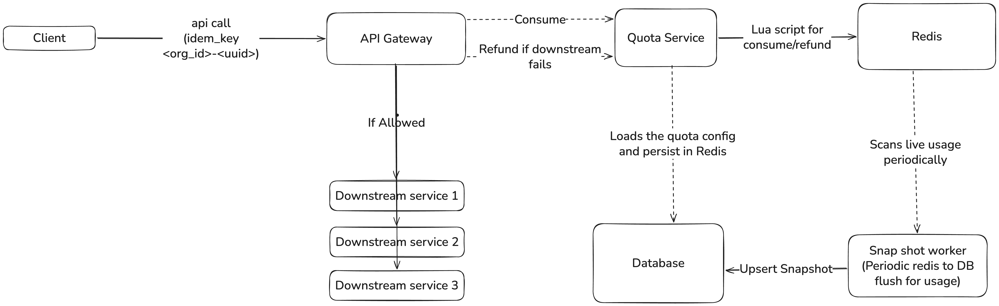

# DESIGN

High Level Design of working of Quota management Service



## Integration shape

This repository provides a FastAPI service exposing:

- `POST /quota/consume`
- `POST /quota/refund`
- `GET /quota/usage`

`QuotaService` is the core component used by API handlers and tests.

## Shared state and correctness model

Redis stores:

1. `quota:{org_id}:{feature}:{period}:state`
   - `limit`
   - `used`

2. `quota:request:{request_id}:meta`
   - `org_id`
   - `feature`
   - `period`
   - `units`
   - `status`

In short: the `state` key tracks live quota counters per org-feature-period, while the `meta` key tracks per-request idempotency and refund context.

TTL policy:
- state key TTL: `seconds_until_period_end + 7 days`
- request metadata TTL: `1 hour`

Atomic correctness comes from Lua script execution (`EVALSHA`) in Redis:

- `consume.lua` checks `request_key.status` for idempotency, validates quota, increments `used`, and writes request metadata with `status=consumed`.
- `refund.lua` resolves refund amount and period from `request_key`, decrements `used`, and flips `status=refunded` idempotently.

Because each script runs atomically, concurrent updates for the same key cannot over-serve or go negative.

## Batch policy

All-or-nothing: if a request asks for `N` units and fewer than `N` are available, request is rejected (`quota_exceeded`). Partial fulfillment is not supported.

## Failure and retry semantics

- **Request ID ownership:** `request_id` is a globally unique UUID generated by the API gateway for every incoming API call. Clients do not generate or manage it.
- **Client retries:** deduplicated via request ledger (`quota:request:{request_id}:meta.status`).
- **Downstream failure after consume:** caller invokes `refund` with only `request_id`.
- **Double refund attempts:** return `already_refunded`; no second decrement.
- **Redis unavailable:** fail closed with HTTP `503 quota_service_unavailable`.

## Reset and reporting

Period is UTC calendar month (`YYYY-MM`) derived at request time.

- Reset is implicit by key rollover to new month.
- `GET /quota/usage` returns current month from Redis with `reset_at`.
- Historical durability is handled by periodic snapshots in Postgres (`monthly_usage`).

## Durability and recovery

Postgres is used for:

- durable `quota_configs`
- periodic snapshots (`monthly_usage`)
- restoring Redis baseline on first access (lazy init)

Snapshot worker performs overwrite upsert (idempotent), not delta accumulation:

- `used_units = EXCLUDED.used_units`

If Redis is catastrophically lost, service can rebuild from latest Postgres snapshot, acknowledging loss window up to snapshot interval plus Redis AOF durability window.

## Real test evidence in this repo

Included tests prove:

- idempotent consume
- idempotent refund
- refund precondition checks
- no over-service under 1000 concurrent requests at quota 500
- snapshot overwrite idempotency

Run with:

```bash
pytest -q
```

## Scale-up path to 50k orgs

Current design is suitable for take-home and moderate production traffic. To scale further:

1. Redis Cluster sharding with `org_id` as the shard key to distribute quota traffic across Redis nodes using consistent hashing.
2. Kafka as a durable, scalable snapshot/event pipeline, partitioned by `org_id` to spread ingestion and processing load.
3. Stronger reconciliation pipeline between Redis live state and the durable Kafka/Postgres history.
4. Isolate very hot org-feature keys (traffic shaping/admission control).
5. Multi-worker API replicas; keep scripts and key schema unchanged.
